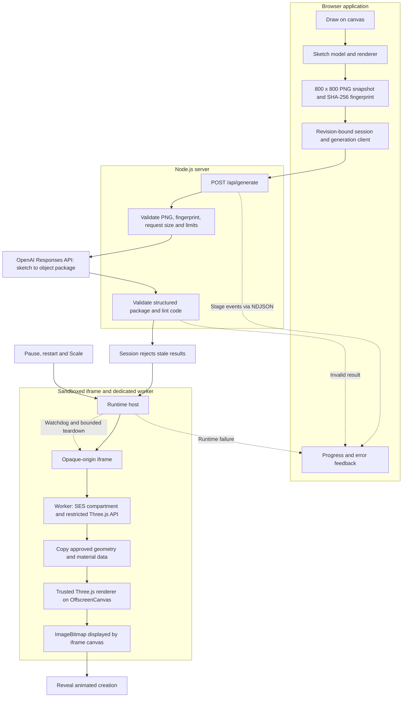

Paper Machines

Bring your sketches to life. Turn a little ink and imagination into an animated 3D creation.

## Run

npm start

### First-time setup

Use Node.js 22 or newer and a current Chrome browser. Install dependencies with `npm ci`, then create a `.env` file in the project root:

```dotenv
OPENAI_API_KEY=your_api_key_here
```

The server loads `.env` automatically. Keep it out of version control. `OPENAI_MODEL` optionally overrides the model configured in `server.mjs`; the key needs access to that model. Generation makes paid API requests. `npm run dev` starts the server with file watching.

## How it works

Draw directly on the canvas, preview the captured sketch, then choose **Bring to life**. The server sends that exact sketch to OpenAI and requests a structured package containing the subject's geometry and animation code. The browser validates the returned package and runs it inside an isolated runtime, revealing the creation only once a rendered frame is ready.

The result is procedural Three.js geometry and animation. The application supplies the camera, lighting, and neutral background. Pause, restart, and Scale control the creation without another generation request.



### Drawing and capture

- [`sketch-model.js`](public/sketch-model.js) owns strokes, undo/redo, and the sketch revision. [`sketch-renderer.js`](public/sketch-renderer.js) draws that state onto the canvas.
- [`sketch-snapshot.js`](public/sketch-snapshot.js) captures an opaque PNG and fingerprints its exact bytes. The image ID and revision identify which drawing a result belongs to; they are not a saved-version history.
- [`sketch-session.js`](public/sketch-session.js) manages capture and request identity. Editing or cancelling invalidates pending work, and stale responses cannot replace a newer sketch.
- [`paper-machines.js`](public/paper-machines.js) connects drawing, preview, generation, feedback, and playback. Input is drawing-only; there is no file-import flow.

### Generation and progress

[`server.mjs`](server.mjs) serves the application, builds the runtime bundles in memory with esbuild, and routes generation requests to [`generation-service.mjs`](src/paper-machines/generation-service.mjs).

The service checks the PNG structure, dimensions, fingerprint, and nonblank content before sending it to the Responses API. The model receives the sketch and a strict JSON schema. The server then restores the request's identity fields, validates the returned package, and uses Acorn to check syntax and disallowed code patterns. Linting is an early check, not the execution sandbox.

[`generation-client.js`](public/generation-client.js) reads newline-delimited JSON progress events. [`generation-progress.js`](public/generation-progress.js) displays real stages and elapsed time—not token-by-token code construction or an estimated percentage. Invalid output produces an error and permits a manual retry; there is no automatic repair loop.

The API key stays on the server. The captured sketch is sent to OpenAI when generation is requested. Generation requests use `store: false`; this is not a claim of zero provider retention.

### Generated object contract

[`object-contract.mjs`](src/paper-machines/object-contract.mjs) defines the package format: source identity, subject description, assumptions, bounds, animation settings, and a JavaScript factory body. The factory receives restricted `THREE` constructors and seeded `random`, and returns:

```js
return {
  root,                      // Subject geometry, not the host scene
  update({ elapsedSeconds, deltaSeconds, tick }) {
    // Animate using the supplied clock.
  },
  dispose() {
    // Release the object's owned resources.
  },
};
```

The worker supplies fixed 30 Hz animation steps. Pause stops animation ticks; restart rebuilds the object with the same seed. Scale changes the trusted camera's zoom and can redraw a paused frame without advancing the animation.

### Runtime isolation and cleanup

[`host.js`](src/runtime/host.js) manages a sandboxed iframe, command sequencing, timeouts, and teardown. [`assets.mjs`](src/runtime/assets.mjs) constructs the iframe document with a restrictive Content Security Policy. The iframe starts a dedicated worker; [`worker.js`](src/runtime/worker.js) evaluates the factory in a SES compartment with a restricted API.

Generated code does not receive the application DOM, credentials, storage, network APIs, camera, or renderer. [`protocol.js`](src/runtime/protocol.js) validates commands and cross-boundary events using execution IDs and sequence numbers. Camera-scale messages accept only a bounded numeric value.

[`geometry-copy.js`](src/runtime/geometry-copy.js) copies approved numeric geometry, transforms, and material properties into a trusted scene. Generated render callbacks, shaders, and textures are not copied. [`surface-policy.js`](src/runtime/surface-policy.js) detects open surfaces in that copied geometry and makes default opaque front-sided sheets visible from both sides.

The worker renders to an `OffscreenCanvas` and transfers an `ImageBitmap` to the iframe for display. The iframe closes each bitmap after drawing it. Only status events—not guest rendering callbacks—reach the application.

Limits in [`limits.js`](src/runtime/limits.js) include:

| Resource | Limit |
| --- | --- |
| Startup response | 5 seconds |
| Frame response | 1 second |
| Cooperative cleanup | 250 ms, then forced teardown |
| Object graph | 128 nodes; depth 32 |
| Geometry per copied object | 100,000 vertices; 600,000 indices; 8 MiB of attribute/index data |
| Materials / draw calls | 128 each |
| Scale | 70–125% |

Only one command is in flight at a time. Scale updates are coalesced. Replacement hides the previous creation immediately and allows a short cleanup window, with at most one active and one retiring runtime. Trusted resources are released even if the guest cleanup hook throws; a hung worker is terminated through teardown.

These are execution and trusted-rendering limits, not a hard browser-process memory or GPU quota. A single sketch also cannot specify exact unseen geometry, and the animation is not a physical simulation.

## Verification

```sh
npm test
npm run test:browser
npm run test:runtime
```

`npm test` runs the unit tests. Browser checks require Playwright and Chrome/Chromium; `PLAYWRIGHT_MODULE` can point to an installed Playwright module, and `CHROME_PATH` can select the browser executable. Start the app with `npm start` before `test:browser`; `test:runtime` starts its own temporary server.

- **Browser integration:** drawing, capture identity, cancellation, generation feedback, reveal, pause/resume, restart, Scale while paused, return-to-drawing, and mobile layout. Provider responses are mocked, so these checks do not make paid generation requests.
- **Runtime checks:** visible rendering, blocked capabilities, message validation, repeated starts, stuck code, and bounded cleanup.
- **Generation evaluation:** `npm run test:eval` makes real API requests against the sketch corpus. [`review-runtime.mjs`](test/eval/review-runtime.mjs) separately checks saved generation results for visible output, motion, restart consistency, and disposal without additional API calls. Saved results are not bundled with a fresh clone.
